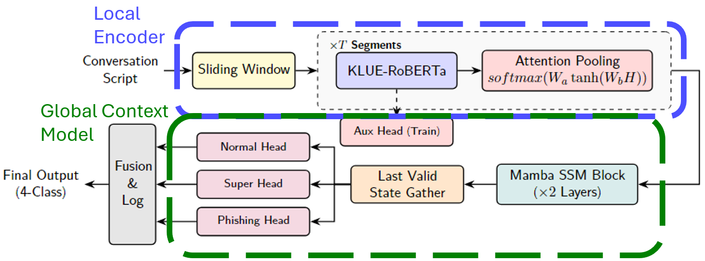
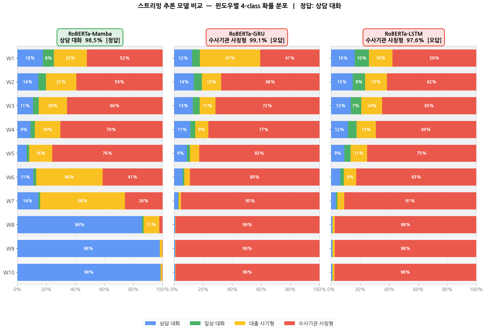

# 텍스트 기반 실시간 보이스피싱 탐지 시스템
**Text-based Streaming Voice Phishing Detection System**

서울과학기술대학교 인공지능응용학과 | 김나현, 정지훈, 박종열

---

## 개요

보이스피싱 피해 증가로 인해 통화 중 위험 신호를 조기에 탐지하는 기술이 필요하다. 본 프로젝트는 음성 통화를 텍스트로 변환한 뒤, 대화의 문맥과 시간적 흐름을 분석하여 보이스피싱 위험을 탐지하는 **텍스트 기반 스트리밍 보이스피싱 탐지 시스템**을 개발한다.

- AI Hub 대화 데이터와 금융감독원 피싱 녹취를 기반으로 Whisper STT, LLM 증강, 3단계 위험도 라벨링을 적용해 학습 데이터를 구성
- **KLUE-RoBERTa** 기반 인코더와 **Mamba** 기반 전역 문맥 모델링 구조를 결합해 세그먼트 단위 의미 표현과 대화 흐름 기반 위험 누적을 함께 모델링
- 베이스 모델 기준 **Accuracy 99.38% / Macro F1 99.37%** 달성
- 웹 데모 시스템을 통해 위험 접수·피싱 유형·대응 가이드를 실시간으로 제공

---

## 모델 아키텍처



**Auxiliary Head** — 학습 단계에서 보조 분류 손실을 적용해 Local Encoder가 개별 세그먼트 수준의 보이스피싱 단서를 더 잘 학습하도록 유도

### 손실 함수 (Hierarchical CrossEntropy Loss)

```
L_HCE = L_super + λ · (L_normal + L_phishing) + β_t · L_aux

λ = 0.5,  β_t = 0.5 − 0.4 · (t / T)
```

| 손실 항 | 설명 |
|---|---|
| `L_super` | 4-class 전체 분류 손실 (Normal vs Phishing Superclass) |
| `L_phishing` | 피싱 클래스 내 세분류 손실 |
| `L_normal` | 일반 클래스 내 세분류 손실 |
| `L_aux` | Ordinal Regression 보조 손실 (단계별 경계 학습) |

---

## 데이터셋

**4-class 분류** — 상담 대화 / 일상 대화 / 대출 사기형 / 수사기관 사칭형

| 클래스 | Label | Train | Val | Test | Original+Noise | LLM+Noise | LLM+Clean | 합계 |
|---|:---:|:---:|:---:|:---:|:---:|:---:|:---:|:---:|
| 상담 대화 | 0 | 600 | 200 | 200 | 100 | 600 | 300 | 1,000 |
| 일상 대화 | 1 | 600 | 200 | 200 | 100 | 600 | 300 | 1,000 |
| 대출 사기형 | 2 | 600 | 200 | 200 | 190 | 540 | 270 | 1,000 |
| 수사기관 사칭형 | 3 | 600 | 200 | 200 | 323 | 451 | 226 | 1,000 |
| **합계** | — | **2,400** | **800** | **800** | 713 | 2,191 | 1,096 | **4,000** |

**데이터 출처**
- **AI Hub** — 민간 민원 상담 LLM 사전학습 및 Instruction Tuning (상담 대화), 주제별 텍스트 일상 대화 (일상 대화), 상담 음성 (Whisper ASR 노이즈 측정)
- **금융감독원** — 보이스피싱 음성 녹취 (대출 사기형 190건, 수사기관 사칭형 323건)

**데이터 파이프라인**

```
STEP 1            STEP 2              STEP 3                STEP 4
원본 데이터 통합  →  LLM 기반 대화 생성  →  Segment Risk Labeling  →  ASR 노이즈 주입
```

- Whisper small 기반 STT → Levenshtein 편집 거리로 오류율 측정
- `gpt-4o-mini`를 사용하여 문장별 3단계 피싱 위험도 라벨링
- 규칙적 변환(랜덤 샘플링)으로 텍스트에 노이즈 적용

---

## 실험 결과

### 베이스 모델 성능 (RoBERTa + Mamba L2, d_state=16, w64)

| 클래스 | F1 | Precision | Recall |
|---|:---:|:---:|:---:|
| 상담 대화 | 1.0000 | 1.0000 | 1.0000 |
| 일상 대화 | 1.0000 | 1.0000 | 1.0000 |
| 대출 사기형 | 0.9876 | 0.9803 | 0.9950 |
| 수사기관 사칭형 | 0.9874 | 0.9949 | 0.9800 |
| **Macro F1** | **0.9937** | — | — |

### 스트리밍 추론 비교 (윈도우별 4-class 확률 분포)



RoBERTa-Mamba는 초반 윈도우(W1~W5)에서도 정답 클래스(상담 대화)로 수렴하는 반면, GRU·LSTM은 수사기관 사칭형으로 오분류가 지속되다가 후반에야 수정된다.

### Ablation Study

| 실험 | 변수 | 설정 | Accuracy | Macro F1 |
|---|---|---|:---:|:---:|
| Mamba Layer | Layer | L1 | 0.9938 | 0.9938 |
| | | **L2 (base)** | **0.9938** | **0.9937** |
| Local Encoder | Model | **RoBERTa (base)** | **0.9938** | **0.9937** |
| | | BERT | 0.9900 | 0.9900 |
| | | KoBERT | 0.9875 | 0.9875 |
| | | KoELECTRA | 0.9762 | 0.9764 |
| Global Context Model | Model | **Mamba (base)** | **0.9938** | **0.9937** |
| | | GRU | 0.9925 | 0.9925 |
| | | LSTM | 0.9925 | 0.9925 |
| d_state | Mamba state dim | **16 (base)** | **0.9938** | **0.9938** |
| | | 32 | 0.9925 | 0.9925 |
| Window Size | | 64 | 0.9950 | 0.9950 |
| | | **W64 (base)** | **0.9938** | **0.9937** |
| | | W32 | 0.9889 | 0.9889 |

---

## 실행 방법

데모 서비스는 `AIShield-demo/` 디렉토리에서 실행합니다. frontend / backend / classifier / guidance 4개 서비스로 구성됩니다.

### Step 1 — 모델 가중치 배치

체크포인트 파일(`.pt`)을 아래 경로에 복사합니다:

```text
AIShield-demo/models/classifier/checkpoints/roberta_mamba_freeze_init_4class_4class_20260517_174922_best.pt
```

파일이 없으면 classifier 서비스가 `degraded` 상태로 뜨고 실제 예측이 동작하지 않습니다. 프론트엔드 폴백 화면은 가중치 없이도 동작합니다.

### Step 2 — 환경변수 설정

```bash
cd AIShield-demo
cp .env.example .env
```

`.env` 주요 항목:

| 변수 | 기본값 | 설명 |
|------|--------|------|
| `CLASSIFIER_DEVICE` | `cuda` | CPU 환경이면 `cpu` 로 변경 (단, mamba_ssm CUDA 커널 필수라 CPU에서 모델 추론 불가) |
| `ROBERTA_MAMBA_MODEL_PATH` | `/app/checkpoints/roberta_mamba_freeze_init_4class_4class_20260517_174922_best.pt` | 다른 체크포인트 사용 시 경로 지정 |

### Step 3 — 전체 서비스 실행 (Docker Compose)

```bash
docker compose up --build
```

빌드 완료 후 `http://localhost` 에서 UI를 확인합니다.

> 초기 실행 시 Whisper 모델(`Systran/faster-whisper-small`) 다운로드로 수 분이 소요될 수 있습니다.

### 서비스 URL

| 서비스 | URL |
|--------|-----|
| 프론트엔드 | `http://localhost` |
| 백엔드 헬스체크 | `http://localhost:8000/health` |
| 분류기 헬스체크 | `http://localhost:8001/health` |
| 가이던스 헬스체크 | `http://localhost:8002/health` |

### UI 단독 실행 (백엔드 없이 화면만 확인)

```bash
cd AIShield-demo/frontend
npm install
npm run dev
```

`http://localhost:5174` 에서 확인합니다. 백엔드가 없으면 발표용 폴백 결과로 자동 전환됩니다.

### 백엔드 단독 실행 (Docker 없이)

```bash
cd AIShield-demo/backend
python3 -m venv .venv
source .venv/bin/activate
pip install -r requirements.txt
uvicorn main:app --host 0.0.0.0 --port 8000
```

로컬에서 classifier / guidance 서비스도 함께 띄울 경우 환경변수를 설정합니다:

```bash
export CLASSIFIER_URL=http://localhost:8001
export GUIDANCE_URL=http://localhost:8002
```

---

## 프로젝트 구조

→ [docs/PROJECT_FILE_STRUCTURE.md](docs/PROJECT_FILE_STRUCTURE.md) 참고

---

## 데이터 정책

### ⚠️ 이 저장소에는 학습 데이터가 포함되지 않습니다

본 프로젝트는 실제 보이스피싱 통화 및 일반 통화 음성·전사 데이터를 사용합니다.
해당 데이터는 **개인정보 및 저작권 보호**를 위해 Git 저장소에 포함하지 않습니다.

| 경로 | 설명 | 제외 이유 |
|---|---|---|
| `Data/` | 원본 음성 데이터셋 (`.wav`, `.mp3`) | 음성 개인정보 |
| `normal_data_reference/` | 일반 대화 JSON 원본 (AI Hub) | 라이선스·개인정보 |
| `models/main/model_architecture/data/` | 전처리된 학습 데이터 | 실제 통화 내용 포함 |
| `models/main/data_augmentation/transcriptions/` | STT 전사 결과 CSV | 실제 통화 내용 포함 |
| `models/main/data_augmentation/error_analysis/*.csv` | STT 오류 분석 CSV | 전사 텍스트 포함 |
| `models/main/data_augmentation/output/` | 최종 학습용 CSV | 전사 내용 파생 데이터 |
| `data_analysis/output/*.csv` / `*.json` | 데이터 분석 산출물 | 전사 내용 파생 데이터 |
| `models/*/checkpoints/` | 모델 체크포인트 | 용량 |
| `models/*/logs/` | 학습 로그 | 재현 가능 |

> **⚠️ 이 파일들을 절대 `git add` 하지 마세요.**  
> `git add .` 대신 파일을 명시하거나 `git add -p`를 사용하세요.

### 데이터 준비 가이드 (학습 재현)

학습 파이프라인 전체를 재현하려면 아래 순서대로 원본 데이터를 준비하세요.

#### Step 1 — 원본 데이터 다운로드

**보이스피싱 데이터 (금융감독원)**

```
출처: 금융감독원 보이스피싱피해 바로고
URL : https://www.fss.or.kr/fss/bbs/B0000203/list.do?menuNo=200686
```

다운로드 후 아래 구조로 배치하세요:

```
models/main/model_architecture/data/phishing/
├── 대출 사기형/          ← 폴더명 정확히 일치해야 함
│   ├── 1.mp3
│   ├── 2.mp3
│   └── ...              (총 190건)
└── 수사기관 사칭형/       ← 폴더명 정확히 일치해야 함
    ├── 1.mp3
    └── ...              (총 323건)
```

> 폴더명은 `대출 사기형`, `수사기관 사칭형` 이어야 합니다.  
> 빌드 스크립트가 하위 폴더명을 카테고리(label)로 자동 매핑합니다.

**일반 대화 데이터 (AI Hub)**

```
출처: AI Hub — https://aihub.or.kr
  ① 민간 민원 상담 LLM 사전학습 및 Instruction Tuning  (콜센터 상담 대화 — 상담 대화 클래스)
  ② 주제별 텍스트 일상 대화                            (SNS/일상 대화 — 일상 대화 클래스)
  ③ 상담 음성                                        (Whisper ASR 노이즈 측정용 — 음성 + GT 전사 스크립트 제공)
```

데이터셋 ①②의 텍스트 JSON 원본 파일은 `normal_data_reference/` 하위에 배치합니다:

```
normal_data_reference/
├── Training/
│   ├── TL_01. KAKAO(1)/   ← 카카오톡 대화
│   ├── TL_02. FACEBOOK/
│   ├── TL_03. INSTAGRAM/
│   ├── TL_04. BAND/
│   └── TL_05. NATEON/
└── Validation/
    ├── VL_01. KAKAO/
    ├── VL_02. FACEBOOK/
    ├── VL_03. INSTAGRAM/
    ├── VL_04. BAND/
    └── VL_05. NATEON/
```

데이터셋 ③의 음성 파일(Whisper ASR 노이즈 측정용)은 아래 경로에 배치합니다:

```
models/main/model_architecture/data/normal/
└── [카테고리 폴더명]/
    └── *.wav (또는 *.mp3)
```

#### Step 2 — STT 전사

```bash
conda activate capstone

# GPU (권장, ~수 시간)
python models/main/data_augmentation/batch_transcribe.py --variant gpu_small

# 이전 실행에서 이어받기
python models/main/data_augmentation/batch_transcribe.py --variant gpu_small --resume
```

출력: `models/main/data_augmentation/transcriptions/gpu_small/{phishing,normal,all}.csv`

#### Step 3 — LLM 기반 데이터 증강

```bash
# .env에 OPENAI_API_KEY 설정 필요
python models/main/data_augmentation/phishing_augmentation/augment.py  # 보이스피싱
python models/main/data_augmentation/normal_augmentation/augment.py    # 일반 대화
```

출력:
- `models/main/data_augmentation/phishing_augmentation/output/phishing_augmented.csv`
- `models/main/data_augmentation/normal_augmentation/output/normal_augmented.csv`

#### Step 4 — 4클래스 학습 데이터셋 빌드

```bash
python models/main/data_augmentation/build_4class_dataset.py
```

출력: `models/main/data_augmentation/output/4class/{train,val,test}.csv`

컬럼: `id, text, label, binary_label, category, source, filename, segment_risks`

#### Step 5 — 모델 학습

```bash
# 베이스 모델: KLUE-RoBERTa + Mamba
python models/experiments/model_architecture/roberta_mamba_freeze_init_4class/train.py

# 기타 실험 모델 (experiments/ 하위 각 폴더)
python models/experiments/model_architecture/<실험명>/train.py
```

학습 데이터 경로는 각 모델의 `config.py` 내 `DATA_DIR` 변수로 관리됩니다  
(기본값: `models/main/data_augmentation/output/4class/`).

---

## 참고 문헌

1. R. Pappagari et al., "Hierarchical transformers for long document classification," in *Proc. 2019 IEEE ASRU*, pp. 838–844.
2. Y. Liu et al., "RoBERTa: A robustly optimized BERT pretraining approach," *arXiv:1907.11692*, 2019.
3. J. Rae et al., "Compressive transformers for long range sequence modelling," *arXiv:1911.05507*, 2019.
4. A. Gu and T. Dao, "Mamba: Linear-time sequence modelling with selective state spaces," *arXiv:2312.00752*, 2023.
5. M. K. Moussavou Boussougou and D. J. Park, "Attention-based 1D CNN-BiLSTM hybrid model enhanced with FastText word embedding for Korean voice phishing detection," *Mathematics*, vol. 11, no. 14, Art. no. 3217, 2023.
6. J. Y. Sim et al., "Voice phishing detection scheme using a GPT-3.5 based large language model," *Journal of KIISE*, vol. 51, no. 1, 2024.
7. S. Kim and S. Noh, "딥러닝 기반 NLP 및 작성기법을 활용한 보이스피싱 의심발언 탐지," *한국전자거래학회지*, vol. 29, no. 4, pp. 139–148, 2024.
8. H. Park et al., "Enhanced voice phishing detection using an LLM-based framework for data augmentation and classification," *IEEE Access*, 2025. doi: 10.1109/ACCESS.2025.3603007.
9. 금융감독원, "보이스피싱체험관: 바로 그 목소리, 그놈 목소리 데이터셋" [Online]. Available: https://www.fss.or.kr/fss/bbs/B0000203/list.do?menuNo=200686. [Accessed: May 19, 2026].
