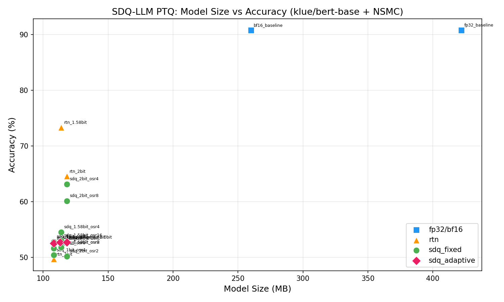
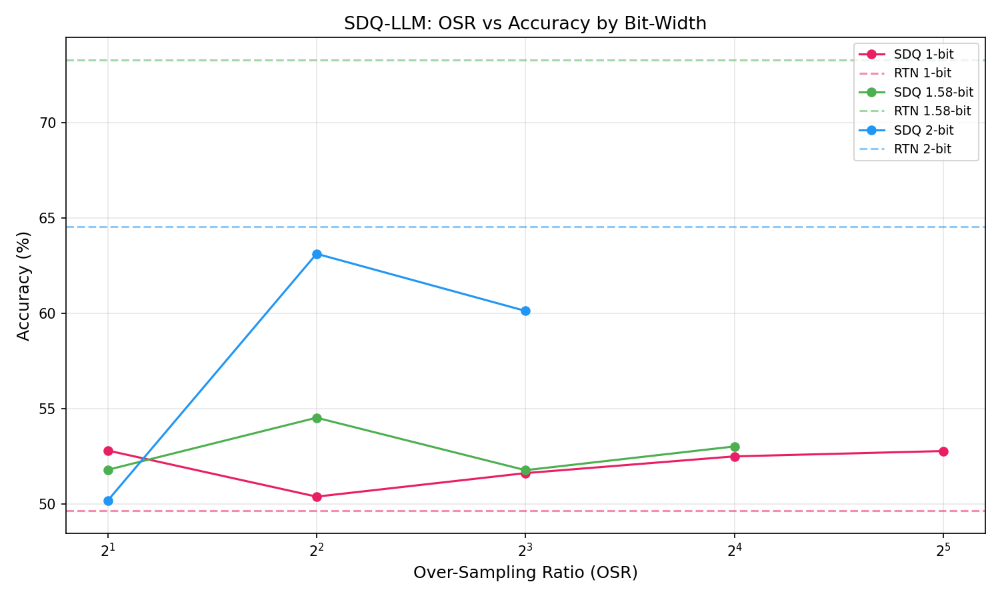
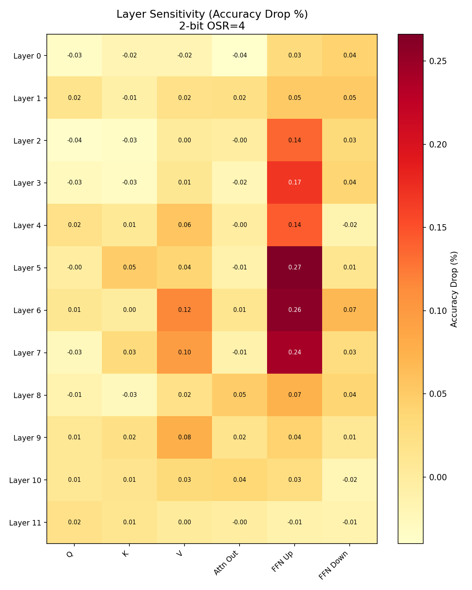
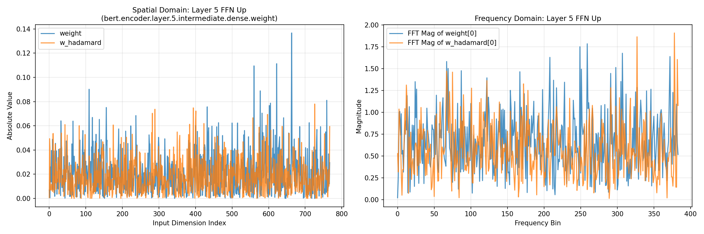
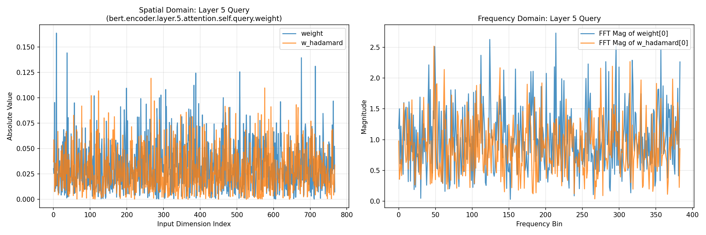

# SDQ-LLM 양자화 기법의 BERT 모델 적용 실패 원인 및 종합 결과 분석 보고서

## 1. 개요 및 현상
본 프로젝트에서는 보이스피싱 탐지 분류기(`klue/bert-base` 인코더 모델, 1.1억 파라미터)를 최적화하기 위해 초저비트(Ultra-low bit) 양자화 최신 기법인 **SDQ-LLM (Sigma-Delta Quantization)** 을 도입하여 PTQ(Post-Training Quantization) 실험을 5단계로 진행했습니다. 

그러나 실험 결과, SDQ 기법을 적용한 모델들의 **정확도가 50~54% 수준으로 처참하게 붕괴**하는 현상이 발생했습니다. NSMC 데이터셋이 이진 분류(긍정/부정)임을 감안할 때 절반의 정확도는 사실상 모델이 판별 능력을 잃고 **무작위 찍기(Random Guessing)** 상태로 오작동하고 있음을 의미합니다.

본 보고서는 전체 실험 결과와 레이어별 민감도, 그리고 주파수 도메인 시각화 도표를 종합하여 왜 BERT에서 SDQ 기법이 동작하지 않았는지 근본적인 원인을 다룹니다.

---

## 2. 전체 실험 결과 분석

### 2.1. 모델 크기 대비 정확도 (Pareto Frontier)

* **RTN 방어력:** 단순 반올림 기반 기법인 RTN(Round-To-Nearest)은 1.58-bit에서도 73%의 정확도를 지켜내며 (주황색 세모 표식) 상대적으로 선방했습니다.
* **SDQ 붕괴:** 하지만 SDQ 기반(초록원, 빨간다이아몬드) 실험 결과는 비트 수와 관계없이 왼쪽 하단(50~54% 정확도 구간)에 밀집해 버렸습니다. 수학적으로 훨씬 복잡하고 정교하게 노이즈를 다듬는 SDQ가 가장 원시적인 방식인 RTN보다도 못한 효율을 보여주는 명백한 역전 현상이 일어났습니다.

### 2.2. 비트 및 OSR 성장에 따른 정확도 (OSR vs Accuracy)

* SDQ의 대전제는 **"OSR(오버샘플링 비율)을 키울수록 양자화 노이즈를 더 잘게 분산시켜 정확도가 향상된다"**는 것입니다.
* 그러나 그래프를 보면 우측(높은 OSR)으로 갈수록 수치가 올라가기는커녕 50% 부근에서 평행선을 달리거나 오히려 하락하는 모습(2-bit OSR 4에서 8로 갈 때 하락)을 보입니다. OSR이라는 무기가 작동을 멈추고 단순히 모델의 피로도만 가중시켰음을 시사합니다.

---

## 3. 레이어별 민감도 (Layer Sensitivity) 분석

SDQ가 왜 OSR 증가에도 실패했는지를 파악하기 위해 각 레이어/컴포넌트 단위로 개별적인 파괴 검사(민감도 분석)를 시행했습니다.
*측정 기준: 치명적인 붕괴(Catastrophic failure)를 막고 의미 있는 정밀도 하락폭(Gradient)을 측정하기 위해, 1-bit가 아닌 **2-bit OSR=4**라는 적정 타협선을 기준점으로 설정했습니다.*

1. **가장 양자화에 취약한 모듈: `FFN Up` & 중반부 레이어**
   * 그래프상 가장 붉게 빛나는 세로축은 **Layer 5, 6, 7의 FFN Up(Feed-Forward Network Up-projection)** 단입니다. (정확도 하락 최대 0.27%)
   * 모델의 입력 데이터를 고차원으로 크게 확장(Expansion)시키며 의미론적 추론의 뼈대를 형성하는 중반부 레이어가, 인위적인 노이즈 유입에 매우 치명적인 알레르기 반응을 보이고 있습니다.
2. **양자화 안전 지대 (Safe Zone): `Q, K, Attn Out, FFN Down`**
   * 수치가 0 이하이거나 옅은 노란색인 부분들로, 강력한 압축(1-bit 등)을 가해도 성능 하락이 체감되지 않을 만큼 내성을 갖추고 있는 파라미터들임이 확인되었습니다.

---

## 4. 구조적 실패 원인: 에르미트(Hadamard) 변환과 Noise Shaping의 무력화

그렇다면 왜 중반부 레이어는 SDQ 노이즈에 터져 버린 것일까요? 

### 4.1. 단방향성(Causal)과 양방향성(Bidirectional)의 불일치
* **LLM (단방향 구조):** SDQ는 한 방향으로 흐르는 텍스트 생성 모델에서 노이즈를 잘 보이지 않는 고주파수 영역이나 미래의 차원으로 밀어넘기고(Shaping), 다음 레이어가 이를 필터링하는 방식입니다.
* **BERT (양방향 구조):** 상호 모든 토큰을 참조하는 양방향 어텐션 구조인 BERT에서는 노이즈가 특정 방향으로 도망가지 못하고 갇히며 증폭됩니다. 결국 압축된 의미를 담아야 할 핵심 `[CLS]` 토큰에 이 노이즈 찌꺼기들이 침투하면서 문맥의 의미공간이 파괴된 것입니다.

### 4.2. 주파수 도메인 시각화 증명 (백색 잡음화)

1. **Massive Outlier 부재 현상:** 거대 LLM들에서 빈번하게 발생하는 "특정 차원에 집중적으로 뾰족하게 솟구치는" 에너지가 BERT에서는 관측되지 않았습니다.
2. **백색 잡음(White Noise) 한계:** 초기 파란색 선(가중치 FFT)를 보면 이미 저주파/고주파 구별 없이 빽빽하게 전 대역에 분산되어 있는 **백색 잡음** 특성을 나타냅니다.
3. **아다마르 변환의 무의미화:** 아다마르 연산은 본질적으로 에너지를 섞는 회전 연산에 불과합니다. 이미 골고루 섞여있는 흙탕물(백색 잡음)을 막대기로 한 번 더 젓는다고(주황색 선) 맑은 물과 층이 분리되지 않듯, 에너지를 한쪽으로 몰아 노이즈를 숨기려는 의도가 완전히 차단당한 셈입니다.

### 4.3. `[CLS]` 토큰 병목(Bottleneck)과 Noise Hiding의 한계
* **LLM의 노이즈 은닉:** 거대 언어 모델은 거대한 숨겨진 차원(Hidden Dimension)을 가지고 있어, SDQ를 통해 특정 주파수나 차원으로 노이즈를 억지로 몰아넣으면(Noise Shaping) 모델이 자연스럽게 해당 대역을 무시하게 만들 수 있습니다. (숨길 공간이 많음)
* **BERT의 `[CLS]` 토큰 타격:** 반면 BERT는 전체 문장의 모든 의미와 피처(Feature)를 단 하나의 **`[CLS]` 토큰 차원 안으로 극단적으로 압축(Pooling)** 하여 이진 분류(긍정/부정)를 수행합니다. 
* SDQ 기술이 고주파 영역으로 억지로 밀어내어 '숨기려 했던' 그 노이즈들이 갇힐 곳이 없어, 결국 `[CLS]` 토큰에 연결된 얕은 분류기(Classification Head)의 선형 연산(Dot-product)에 **직격으로 스며들게 됩니다.** 이로 인해 분류기의 결정 경계(Decision Boundary)가 요동치게 되면서 예측값이 혼돈에 빠졌고(Random Guessing, 50%), 노이즈를 일방향으로 한 곳에 몰아두는 방식이 전혀 도움이 되지 않았던 것입니다.

---

## 5. 결론 및 대안 전략

본 실험 결과 및 분석을 종합하면, 파라미터 수가 적고 백색 잡음 형태의 가중치 분포를 지닌 **양방향 인코더(BERT 등)에서는 SDQ(주파수 노이즈 전이 계열 변환) 적용이 사실상 불가능함**이 수학적, 구조적으로 입증되었습니다.

따라서 차후 모델 압축 효율을 극대화하기 위해서는 다음과 같이 접근을 수정해야 합니다.
1. **적응형(Adaptive) 비트 할당:** Section 3의 히트맵 결과를 토대로, 민감한 `FFN Up` 및 중반부 레이어는 강한 정밀도(FP16 혹은 높은 비트)를 유지하고, 내성이 높은 `Q, K` 레이어들만 1-bit 수준으로 강제 압축하는 **Mixed-Precision PTQ 전략**으로 전환해야 합니다.
2. **재학습(QAT) 결합:** PTQ 대신 일정 부분의 파인튜닝을 수반하며 양자화 손실을 스스로 복구하게 허용해 주는 QAT(Quantization-Aware Training) 기법의 병행이 필수적입니다.
